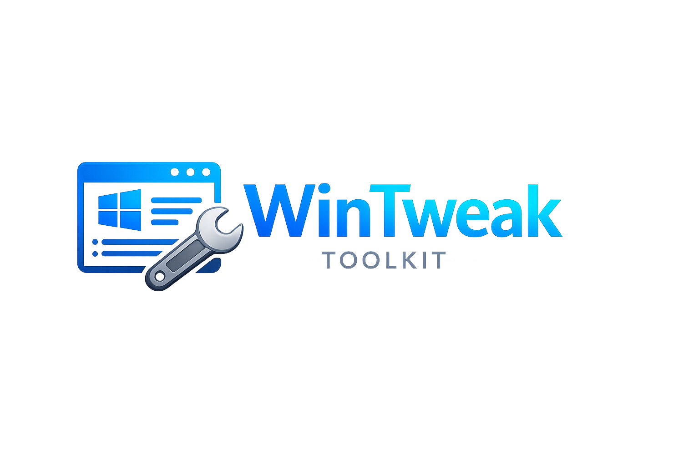

# WinTweak



**WinTweak** is a single-file portable EXE that launches the PowerShell WPF GUI with **1:1 behavior**—no UI redesign and no feature changes. The EXE bundles the scripts and runs them via Windows PowerShell 5.1.

A PowerShell toolkit for trimming down and reclaiming control over Windows 11. Remove bloatware, reduce telemetry and suggested content, and apply a curated set of privacy, UI, and performance tweaks—all through a simple GUI or optional CLI.

## Requirements

- **Windows 11** (some features may work on Windows 10)
- **PowerShell 5.1** or later
- **Run as Administrator** (required for system and app changes)

## Usage

> **Warning**  
> This tool modifies system and app settings. Create a restore point before use and proceed at your own risk.

### Run with WinTweak.exe (recommended)

1. Download **WinTweak.exe** from [Releases](https://github.com/akahobby/WinTweak/releases), or build from source (requires [.NET 8 SDK](https://dotnet.microsoft.com/download/dotnet/8.0)):

   ```powershell
   dotnet publish src/WinTweak.Launcher -c Release -r win-x64 -p:PublishSingleFile=true -p:SelfContained=true -p:IncludeNativeLibrariesForSelfExtract=true
   ```

2. Output is at: **`src/WinTweak.Launcher/bin/Release/net8.0-windows/win-x64/publish/WinTweak.exe`**

3. Run **WinTweak.exe** (it will request Administrator). It extracts the bundled scripts to `%LOCALAPPDATA%\WinTweak\bundle\<version>\` and launches the GUI. Logs: `%LOCALAPPDATA%\WinTweak\launcher.log`.

### Run from a clone (script only)

If you cloned the repo and want to run the script directly:

```powershell
# Open PowerShell as Administrator, then:
Set-ExecutionPolicy -ExecutionPolicy Bypass -Scope Process -Force
cd C:\Path\To\WinTweak
.\Win11Debloat.ps1
```

## Features

- **App removal** — Remove pre‑installed and OEM apps from a recommended list or pick your own.
- **Privacy & suggested content** — Dial back telemetry, activity history, targeted ads, tips, and suggestions across Windows and Edge.
- **AI features** — Disable Copilot, Recall, and other AI options in Windows, Edge, Paint, and Notepad.
- **System behaviour** — Restore classic context menu, turn off mouse acceleration, disable fast startup, and more.
- **Windows Update** — Control when updates install and whether updates are shared with other PCs.
- **Appearance** — Dark mode, disable transparency and animations.
- **Start & taskbar** — Tweak Start layout, search, taskbar alignment, widgets, and taskbar behaviour.
- **File Explorer** — Default open location, show extensions and hidden files, customize navigation pane.
- **Multi‑tasking** — Configure snapping, Snap Assist, and Alt+Tab behaviour.
- **Optional features** — One‑click enable Windows Sandbox or WSL.

Advanced options: apply tweaks to another user profile or to the default user template (e.g. for Sysprep).

## Project structure

| Path | Purpose |
|------|---------|
| **`src/WinTweak.Launcher/`** | .NET 8 launcher; builds **WinTweak.exe** (single-file portable launcher) |
| `Win11Debloat.ps1` | Main script and GUI entry point (used by the launcher and when running from clone) |
| `Apps.json` | App list and metadata for removal |
| `Schemas/` | XAML UI definitions (main window, dialogs) |
| `Scripts/` | GUI and theme helpers, app/tweak logic |
| `Regfiles/` | Registry tweak files |
| `Assets/` | Features.json, Start menu template, branding |

## License

MIT. See [LICENSE](LICENSE) for details.

## Links

- **Repository:** [github.com/akahobby/WinTweak](https://github.com/akahobby/WinTweak)  
- **Issues:** [Report a bug or request a feature](https://github.com/akahobby/WinTweak/issues)
